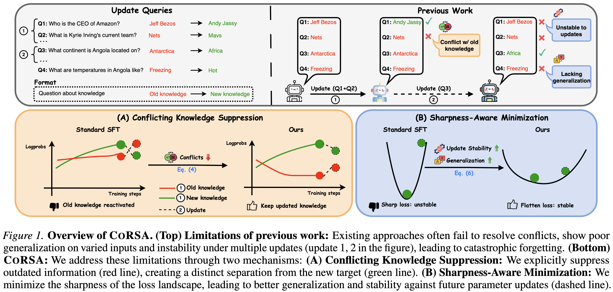

# CoRSA: Conflict-Resolving and Sharpness-Aware Minimization for Generalized Knowledge Editing with Multiple Updates

**Authors:** [Duy Nguyen](https://duykhuongnguyen.github.io/), [Hanqi Xiao](https://hanqixiao.github.io/), [Archiki Prasad](https://archiki.github.io/), [Elias Stengel-Eskin](https://esteng.github.io/), [Hyunji Lee](https://amy-hyunji.github.io/), [Mohit Bansal](https://www.cs.unc.edu/~mbansal/)



## Setup

```bash
uv venv .venv
source .venv/bin/activate
uv pip install torch transformers datasets peft trl vllm
```

## Configuration

All configurations are defined in `src/configs/default.json`. Key fields:

- `model.name`: Model ID or local path
- `dataset`: Dataset name/split/source
- `method.name`: Training method (`lora`, `sam`, or `corsa`)
- `training`: Batch size, epochs, learning rate, output directory, etc.
- `evaluation`: vLLM settings

## Training

### Quick Start

Train CoRSA on CounterFact:

```bash
python src/train.py --config src/configs/default.json --method corsa
```

### Output

Training outputs are saved to `outputs/<model>/<dataset>/<method>/` and include:

- `config.json`: Full resolved configuration
- `metadata.json`: Method, dataset, and model summary
- Model weights and LoRA adapter artifacts

## Evaluation

Evaluate with the trained adapter:

```bash
python src/evaluate.py --config src/configs/default.json --run_dir outputs/<model>/<dataset>/<method>/
```

### Output Files

- `generations*.jsonl`: Per-sample generations
- `generations*.csv`: Generations with correctness labels
- `results*.csv`: Summary results table
